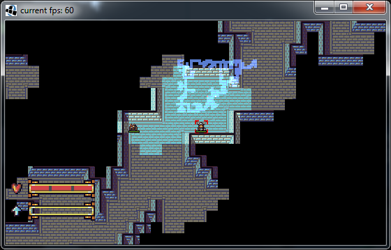

This is the prototype of a roguelike game
--

[](https://travis-ci.org/dasmau89/taloonerrl)

As of now this project probably isn't in a usable state for anybody, but the code that I put out here is licensed under the GPL v2 (or later) license.


#### Rough outline for design:
- Every monster & item should bring a new mechanic to the game (no +1 sword, +2 sword ...)
- Trade-offs: strong monster with weak power vs. weak monster with strong power (like the first two Mysterious Dungeon Games)
- Fully playable with mouse/touchscreen (and keyboard only as well)
- No need for spoilers (full information to the player, maybe Angband-style monster memory(global, not per character))
- Only meaningful mechanics: food-clock not needed when we don't implement healing per turn and so on

#### screenshot


#### getting started
This is an [eclipse](https://www.eclipse.org/) project managed by [Apache Maven](https://maven.apache.org/)

To get started run from the command line:
```
mvn integration-test -P desktop
```

or import this project into eclipse as a maven project and eclipse will do the magic for you. To start the game you need to run TaloonerRlDesktop
